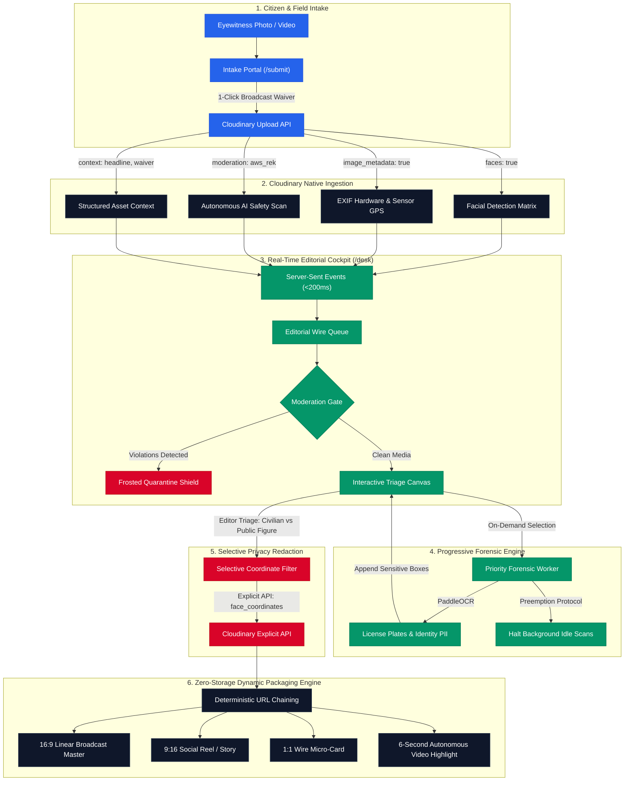

<div align="center">

# 📡 PressWire
### Autonomous Breaking News Intake, Provenance Audit, Selective Privacy Redaction & Zero-Storage Broadcast Syndication

[](https://cloudinary.com)
[](https://fastapi.tiangolo.com)
[](https://python.org)
[](https://react.dev)
[](https://www.typescriptlang.org)
[](https://tailwindcss.com)
[](https://vitejs.dev)
[](LICENSE)

<br />

**Cloudinary Hackathon Track**: **Track 1 · AI Media Pipelines (PS-01)**  
**Live Production Application**: **[https://presswire-h306.onrender.com](https://presswire-h306.onrender.com)**  
**Submission Repository**: [https://github.com/HackIndiaXYZ/pixels-to-products-cloudinary-ai-hackathon-2026-rwik-debnath](https://github.com/HackIndiaXYZ/pixels-to-products-cloudinary-ai-hackathon-2026-rwik-debnath)  
**Development Mirror**: [https://github.com/SLICKRWIK/presswire](https://github.com/SLICKRWIK/presswire)

</div>

---

### 🌐 Live Production Cockpit Links

| Service | Live URL | Purpose |
| :--- | :--- | :--- |
| 🚀 **Live Landing Page** | [presswire-h306.onrender.com](https://presswire-h306.onrender.com) | Product architecture, transformation showcases, and platform overview |
| 📲 **Citizen Intake Portal** | [presswire-h306.onrender.com/submit](https://presswire-h306.onrender.com/submit) | High-speed mobile eyewitness upload with mandatory irrevocable broadcast rights release |
| 🖥️ **Live Editorial Cockpit** | [presswire-h306.onrender.com/desk](https://presswire-h306.onrender.com/desk) | Real-time SSE wire queue, interactive face triage canvas, and playout manager |
| 📖 **Interactive Swagger Docs** | [presswire-h306.onrender.com/docs](https://presswire-h306.onrender.com/docs) | Complete OpenAPI v3 REST API documentation and interactive test endpoints |

---

## 🎯 The Breaking Newsroom Dilemma

During major crises, natural disasters, and breaking civic emergencies, television newsrooms are inundated with hundreds of uncurated eyewitness photos and videos. Editorial and legal teams face three critical operational bottlenecks:

1. **Content Moderation & Graphic Violence Liability**: Unscreened citizen uploads frequently contain graphic violence, hate symbols, or trauma imagery that cannot be exposed to junior editorial staff without prior quarantine.
2. **Privacy, Bystander & PII Liability (DPDP / GDPR)**: Broadcast regulations mandate blurring innocent bystanders, vehicle license registration plates, and citizen identity documents (e.g. Aadhaar, PAN) while keeping elected public figures, spokespeople, and journalists in razor-sharp focus.
3. **Multi-Format Storage & Rendering Explosion**: Formatting the same source footage for 16:9 linear television, 9:16 vertical reels (Shorts / TikTok / Instagram), 1:1 social cards, and 6-second autonomous highlight reels traditionally requires manual re-encoding and duplicate cloud uploads, multiplying cloud storage bills and rendering latencies.

**PressWire solves this** by providing an autonomous, end-to-end AI media intake and broadcast packaging pipeline powered natively by **Cloudinary**. Media enters via a secure citizen portal, undergoes sub-second ingestion, progressive forensic scanning, and selective privacy redaction, and delivers instant, broadcast-ready packages across every platform format with **zero duplicate storage**.

---

## 🏛️ System Architecture



---

## 🌟 Key Technical Innovations

### 1. ⚡ Lazy Progressive Processing & Priority Preemption
- **Sub-Second Wire Arrival (<800ms)**: Incoming media bypasses heavy local preprocessing and uploads directly to Cloudinary with `faces: true` and EXIF metadata, making eyewitness takes immediately visible in the newsroom queue.
- **On-Demand Deep Forensics**: Deep forensic OCR (vehicle license plates, national ID cards) and explicit moderation execute on-demand in the background when an editor clicks an asset.
- **Priority Preemption Protocol**: When an editor switches to an urgent breaking take, any background processing on prior assets is immediately preempted and cancelled, concentrating server resources on the active story without exceeding memory limits.

### 2. 🛡️ Selective Privacy Redaction (Cloudinary Explicit API)
- **Civilian vs. Public Figure Triage**: Newsroom editors inspect detected faces and scene PII directly on the high-res viewfinder canvas.
  - **Civilian / Bystander / License Plate**: Marked as **Redacted** (preserved in coordinate matrix).
  - **Elected Minister / Spokesperson / Reporter**: Marked as **Exempt** (removed from redaction list).
  - **Custom Manual Redaction**: Editors can click and drag to redact uncatalogued bystanders.
- **Single API Call Synchronization**: The backend transmits bystander coordinates to Cloudinary via:
  ```python
  cloudinary.uploader.explicit(
      public_id,
      type="upload",
      face_coordinates=bystander_coords,
      invalidate=True
  )
  ```
- **Dynamic Edge Blurring**: Delivery URLs invoke `e_pixelate_faces:10`, blurring innocent bystanders and license plates while leaving public figures in crisp, unblurred focus.

### 3. 📦 Zero-Storage Dynamic Syndication Packaging
- Every broadcast deliverable is generated on-the-fly via deterministic Cloudinary URL chaining from a **single origin asset**:
  - **16:9 Linear Broadcast Master**: Subject-aware broadcast playout (`c_fill,ar_16:9,g_auto:subject,e_pixelate_faces:10,f_auto,q_auto`). Supports 1-click toggling between Clean Master and Branded Feed.
  - **9:16 Social Reel / Story**: Content-aware vertical formatting with predominant color blur-fill padding (`c_fill,ar_9:16,g_auto:subject,b_auto:predominant,e_pixelate_faces:10`).
  - **1:1 Wire Micro-Card**: Compressed WebP/AVIF square feed thumbnail (`c_fill,ar_1:1,g_auto:subject,e_pixelate_faces:10,f_auto,q_auto`).
  - **6-Second Video Highlight Preview**: Autonomous clip summarization (`e_preview:duration_6:max_seg_3`).
- **1-Click Master Downloads**: Direct playout download packaging (`fl_attachment`) protects broadcast networks from viral CDN egress spikes.

### 4. 📍 Spatiotemporal Geo-Anchor & Multi-Angle Clustering
- Incoming media is automatically clustered into cohesive story packages using sensor GPS coordinates, capture timestamps, and an editable perimeter radius (`cluster_radius_km`).
- **Google Maps Link Resolver**: Newsroom editors can paste shortened (`maps.app.goo.gl`) or standard Google Maps URLs directly into the package anchor; the backend automatically resolves them into canonical latitude and longitude.
- **Angle Switcher**: Clustered packages provide a multi-angle switcher, allowing news producers to toggle between eyewitness perspectives of the same breaking event.

### 5. 🖥️ Full-Bleed Professional Cockpit Layout
- Designed specifically for multi-monitor broadcast control rooms, `/desk` is a full-bleed application (`w-full` edge-to-edge) without restrictive container caps.
- Strict **6 Fixed News Desks Taxonomy**: `Public Safety`, `Severe Weather`, `Politics & Civic`, `Transit & Infrastructure`, `Metro & Local`, and `General Wire`. Breaking status is an orthogonal urgency flag (`urgency`), keeping newsroom filtering standardized.

### 6. ⚖️ Legal Provenance & Hardware Telemetry Audit
- **Mandatory Irrevocable Broadcast Release**: Citizens must check a 1-click copyright waiver before upload, timestamped with submitter IP to indemnify broadcasters against copyright claims.
- **Camera Sensor Telemetry**: Extracts EXIF camera make, model, lens aperture, focal length, capture timestamp, and upload timestamp delta ($\Delta t$) to detect recycled archival imagery.

---

## 🏆 Cloudinary AI Capabilities & Rubric Matrix

PressWire is built from the ground up to leverage Cloudinary's native image and video processing primitives:

| Cloudinary Primitive | Transformation Syntax / Parameter | Architectural Purpose in PressWire | Source Implementation |
| :--- | :--- | :--- | :--- |
| **Upload API** | `faces: true, image_metadata: true` | Auto-detects facial coordinates on ingestion and extracts raw hardware EXIF/GPS telemetry. | [`backend/app/services/intake_service.py`](backend/app/services/intake_service.py) |
| **AI Content Moderation** | `moderation: "aws_rek"` | Autonomous AI safety check to isolate graphic/sensitive media into newsroom quarantine. | [`backend/app/services/intake_service.py`](backend/app/services/intake_service.py) |
| **Structured Metadata** | `context: { headline, urgency, waiver, submitter_ip }` | Embeds newsroom metadata directly into Cloudinary asset context. | [`backend/app/services/intake_service.py`](backend/app/services/intake_service.py) |
| **Explicit API** | `uploader.explicit(..., face_coordinates=[...])` | Overrides the facial coordinate matrix with bystander and scene PII coordinates. | [`backend/app/services/redaction_service.py`](backend/app/services/redaction_service.py) |
| **Privacy Redaction** | `e_pixelate_faces:10` | Real-time edge pixelation applied strictly to the active coordinate matrix. | [`backend/app/services/packaging_service.py`](backend/app/services/packaging_service.py) |
| **Content-Aware Cropping** | `c_fill,ar_16:9,g_auto:subject` | AI subject saliency detection for linear television playout without manual keyframing. | [`backend/app/services/packaging_service.py`](backend/app/services/packaging_service.py) |
| **Smart Background Fill** | `b_auto:predominant` | Auto-detects predominant color palette to blur-fill vertical 9:16 mobile feeds. | [`backend/app/services/packaging_service.py`](backend/app/services/packaging_service.py) |
| **Optimized Delivery** | `f_auto,q_auto` | Delivers optimal format (WebP/AVIF) and perceptual quality at minimum file size. | [`backend/app/services/packaging_service.py`](backend/app/services/packaging_service.py) |
| **Autonomous Previews** | `e_preview:duration_6:max_seg_3` | Generates 6-second dynamic highlight reels from source video without server-side rendering. | [`backend/app/services/packaging_service.py`](backend/app/services/packaging_service.py) |
| **Dynamic Overlays** | `l_text:Arial_28_bold:<headline>,g_south_west` | Renders dynamic lower-third broadcast straps onto television playout feeds. | [`backend/app/services/packaging_service.py`](backend/app/services/packaging_service.py) |
| **Search API** | `expression="tags:presswire AND status:approved"` | Sub-second Lucene queries filtering across editorial desks and moderation states. | [`backend/app/services/search_service.py`](backend/app/services/search_service.py) |

---

## ⚡ 60-Second Judge Evaluation Script

Experience the autonomous pipeline end-to-end on the live production deployment:

1. **Step 1: Ingest Breaking Media (`/submit`)**
   - Open **[presswire-h306.onrender.com/submit](https://presswire-h306.onrender.com/submit)** on your browser or mobile phone.
   - Click the **"5 Takes (Batch Simulation)"** button or upload your own photo/video.
   - Notice the mandatory **irrevocable broadcast copyright release** and the instantaneous upload response (<800ms).
2. **Step 2: Real-Time Wire Arrival (`/desk`)**
   - Navigate to **[presswire-h306.onrender.com/desk](https://presswire-h306.onrender.com/desk)**.
   - The media appears immediately in the wire feed via Server-Sent Events without page reload.
3. **Step 3: Interactive Selective Face Triage**
   - Click on the vehicle incident take. Notice the subtle forensic radar scanner indicating on-demand deep scanning.
   - As the background OCR finishes, a yellow interactive box (`Plate: HR51BV3737`) appears directly over the vehicle registration plate alongside the police officer's red box.
   - Hover over the police officer: Click to toggle between **Redacted (Civilian)** and **Exempt (Public Figure)**.
   - Notice the subtle autosave feedback in the lower-left corner confirming Cloudinary's Explicit API was updated.
4. **Step 4: Inspect Live Playout & Syndication Hub**
   - Switch between **Triage**, **16:9 Broadcast**, **9:16 Reel**, and **1:1 Wire**.
   - Click the **Split Diff Comparison Slider (⇄)** to swipe between the raw camera original and the redacted master.
   - Click **"Copy URL"** on any format and paste it into a new tab: inspect the clean Cloudinary URL chaining executing in real time at the edge CDN!

---

## 📂 Project Structure

```
presswire/
├── backend/
│   ├── app/
│   │   ├── api/v1/endpoints/
│   │   │   ├── intake.py              # Cloudinary Upload API & batch simulation
│   │   │   └── editorial.py           # Editorial triage, focal point & map resolver
│   │   ├── core/
│   │   │   ├── config.py              # Application settings & environment parsing
│   │   │   └── cloudinary_client.py   # Cloudinary SDK configuration
│   │   ├── db/
│   │   │   ├── models.py              # SQLAlchemy SQLite models for persistence
│   │   │   └── persistence.py         # Thread-safe persistent in-memory store
│   │   ├── services/
│   │   │   ├── intake_service.py      # EXIF extraction & Cloudinary upload pipeline
│   │   │   ├── processing_service.py  # Lazy progressive processor & priority preemption
│   │   │   ├── ocr_service.py         # License plate & PII document OCR engine
│   │   │   ├── redaction_service.py   # Cloudinary Explicit API face_coordinates manager
│   │   │   ├── packaging_service.py   # Deterministic URL transformation generator
│   │   │   └── search_service.py      # Cloudinary Search API query builder
│   │   └── main.py                    # FastAPI application & SSE stream endpoint
│   ├── requirements.txt               # Backend dependencies
│   └── tests/                         # Pytest unit & integration test suite
├── frontend/
│   ├── src/
│   │   ├── components/
│   │   │   ├── desk/
│   │   │   │   ├── RedactionCanvas.tsx # Interactive face triage & split diff viewfinder
│   │   │   │   ├── WireQueue.tsx       # Real-time SSE wire queue & news desk filter
│   │   │   │   ├── ProvenanceCard.tsx  # EXIF telemetry inspector & custom bug manager
│   │   │   │   └── BroadcastHub.tsx    # Multi-format playout & download panel
│   │   │   └── landing/                # Public landing page components
│   │   ├── App.tsx                    # Main desk router & SSE connection manager
│   │   ├── types.ts                   # TypeScript interfaces matching backend schemas
│   │   └── index.css                  # Tailwind CSS styling & animations
│   ├── package.json                   # Frontend dependencies
│   └── vite.config.ts                 # Vite build configuration
├── data/
│   └── assets/                        # Sample media assets for newsroom testing
├── start_dev.ps1                      # Windows 1-click startup script
├── start_dev.sh                       # Linux/macOS 1-click startup script
├── Procfile                           # Production deployment process file (Render)
├── render.yaml                        # Render deployment configuration
└── README.md                          # Project documentation & evaluation guide
```

---

## 💻 Local Installation & Setup

### Prerequisites
- Python 3.12+
- Node.js 20+ & npm
- A free [Cloudinary](https://cloudinary.com) account

### Quick Start (One-Command Launch)

**On Windows (PowerShell):**
```powershell
.\start_dev.ps1
```

**On Linux / macOS:**
```bash
chmod +x start_dev.sh
./start_dev.sh
```

---

### Manual Setup

#### 1. Configure Environment Variables
Create a `.env` file in the project root:
```env
CLOUDINARY_CLOUD_NAME=your_cloud_name
CLOUDINARY_API_KEY=your_api_key
CLOUDINARY_API_SECRET=your_api_secret
ENVIRONMENT=development
PORT=8000
```

#### 2. Backend Setup (FastAPI)
```bash
# Create virtual environment
python -m venv backend/venv

# Activate virtual environment
# Windows:
.\backend\venv\Scripts\Activate.ps1
# Linux/macOS:
source backend/venv/bin/activate

# Install dependencies
pip install -r backend/requirements.txt

# Run backend with hot reload
uvicorn app.main:app --host 127.0.0.1 --port 8000 --reload --app-dir backend
```
*Backend Swagger documentation available at `http://127.0.0.1:8000/docs`.*

#### 3. Frontend Setup (React + Vite)
```bash
cd frontend
npm install
npm run dev
```
*Frontend dev server will launch at `http://localhost:5173`.*

---

## 🧪 Testing & Verification

Run the automated test suite to verify the progressive processing engine and Cloudinary integration:

```bash
# Backend unit tests
pytest backend/tests -v

# Frontend TypeScript and build verification
cd frontend && npm run build
```

---

## 📜 Legal & Broadcast Indemnification

- **Autonomous Privacy Redaction**: Strictly complies with bystander anonymity standards and privacy mandates. All civilian face coordinates and vehicle plates are blurred prior to syndicated linear broadcast.
- **Irrevocable Copyright License**: Eyewitnesses submit footage under an irrevocable, royalty-free broadcast license with recorded submitter IP and timestamp telemetry.

---

## 🏆 Hackathon Credits & Submission Details

- **Hackathon**: HackIndia 2026 — Pixels to Products: The Cloudinary AI Hackathon
- **Track**: **Track 1 · AI Media Pipelines (PS-01)**
- **Creator**: **Rwik Debnath** ([@SLICKRWIK](https://github.com/SLICKRWIK))
- **Submission Repo**: [HackIndiaXYZ/pixels-to-products-cloudinary-ai-hackathon-2026-rwik-debnath](https://github.com/HackIndiaXYZ/pixels-to-products-cloudinary-ai-hackathon-2026-rwik-debnath)
- **Production URL**: [https://presswire-h306.onrender.com](https://presswire-h306.onrender.com)
